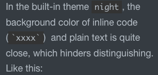

# Customized Theme in Typora 

This repo is located in `~/Library/Application Support/abnerworks.Typora/themes` (Mac), you can go to it from `Typora.app` -`Preference`-`Apperance`-`Themes`-`Open Theme Folder` 

## Rules

* The built-in CSS and their dirs will be replaced after typora update / reinstall, DO NOT MODIFY THEM.
* [how to define custome CSS](https://support.typora.io/Add-Custom-CSS/ )
* [create / install new themes](https://support.typora.io/About-Themes/)
* install new themes: `Typora.app` -`Preference`-`Apperance`-`Themes`-`Get Themes`, it will open theme website.

## Modify existing themes

With this repo, you can do some modification on original themes.

### Add section number

In this repo `./number/number.css`, define section number.

To define a new theme with section number based on an existing `[theme].css`, just create `[theme]-number.css`, and write below into it.

```css
@import "number/number.css"
@import "[theme].css"
```

### Finetune base theme

To finetune an existing base theme `[theme].css`, just create `[new-theme].css`, and write below into it.

```css
@import "[theme].css"

/* the change added to the base theme */
```

#### Example - darken `night`’s background

In the built-in theme `night`, the background color of inline code (`` `xxxx` ``)  and plain text is quite close, which hinders distinguishing. Like this:


To address this, we can darken the background color of inline code. 

Create `night-my.css`, write below into it:

```css
@import "night.css";

pre,
code,
kbd,
tt,
var {
    background: #333;
}
```

Thus, the color changes to:

